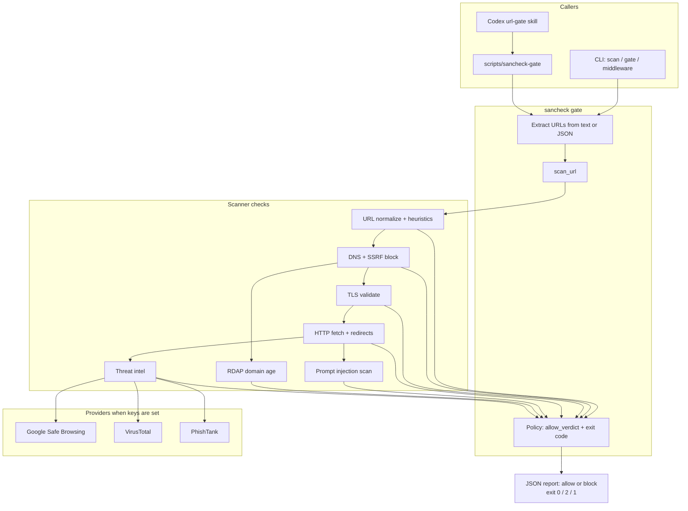

# sancheck

**Repository**: https://github.com/fozagtx/sancheck

**API keys for testing:** [testing keys](https://docs.google.com/document/d/1Ga4IVy5-57BDiO3-JpJu5cgq1fnJpm1Vb943fnYOWB0/edit?usp=sharing)

`sancheck` is a real URL security scanner, link gate, and Codex plugin package. It checks links before an agent workflow, build script, or developer tool opens them, with specific handling for prompt-injection text hidden in fetched pages.

No mock verdicts are used. Network checks are live. Google Safe Browsing, VirusTotal, and PhishTank run only when real API credentials are present; otherwise their checks are reported as `skipped`.

## Architecture



## Documentation

- [How Codex & GPT-5.6 Were Used](CODEX_USAGE.md)
- [Installation & Setup Guide](INSTALL.md)

## Built with Codex

**Codex Session ID**: `019f8658-5272-7480-ae44-3a4ebd620ba2`

Built using Codex with GPT-5.6:
- URL validation and normalization logic
- DNS resolution and SSRF protection
- TLS certificate validation
- HTTP behavior analysis
- Prompt injection detection patterns
- Threat intel provider integrations
- CLI interface and middleware contract

## What It Checks

- URL structure: userinfo tricks, IP literals, uncommon ports, suspicious keywords, long or encoded paths.
- DNS and SSRF safety: loopback, private, link-local, multicast, reserved, and unspecified IPs are blocked by default.
- HTTPS/TLS: certificate chain and expiration are checked for HTTPS URLs.
- HTTP behavior: redirects, status codes, content type, headers, and final targets are inspected.
- Prompt injection: bounded page text and HTML samples are scanned without executing page scripts.
- Reputation: shorteners, risky-looking hosts, new domains via RDAP, and live providers when keys are set.

## Quick Start

From the repo root, after `cp .env.example .env` and filling keys. Paste each command as one full line (do not break `--format=json`).

Allow check:

```sh
PYTHONPATH=src python3 -m sancheck scan https://github.com --format=json
```

Expect `google_safe_browsing` and `virustotal` as `clean` (not `skipped`). Exit `0`.

Block check (Google Safe Browsing test URL):

```sh
PYTHONPATH=src python3 -m sancheck scan https://testsafebrowsing.appspot.com/s/malware.html --format=json; echo exit:$?
```

Expect `google_safe_browsing: match` and `exit:2`.

Plugin / gate (same binary Codex calls):

```sh
plugins/sancheck/scripts/sancheck-gate https://github.com
plugins/sancheck/scripts/sancheck-gate https://testsafebrowsing.appspot.com/s/malware.html; echo exit:$?
```

Exit codes: `0` allow, `2` block, `1` error.

## Codex Plugin Package

The repo includes a bundled plugin at:

```text
plugins/sancheck
```

The plugin contains:

- `.codex-plugin/plugin.json` - Plugin manifest
- `skills/url-gate/SKILL.md` - URL gate skill for Codex
- `scripts/sancheck-gate` - Gate script entry point
- Bundled scanner source under `scripts/src/sancheck`

### Using the Plugin

No Python package install needed. From repo root (with `.env` present):

```sh
plugins/sancheck/scripts/sancheck-gate https://github.com
plugins/sancheck/scripts/sancheck-gate https://testsafebrowsing.appspot.com/s/malware.html; echo exit:$?
```

Same exit codes as CLI: `0` allow, `2` block, `1` error.

### How Codex uses the plugin

The plugin is a skill plus the same `sancheck-gate` script (local gate, same as CLI).

API keys stay on your PC in `.env`. Do not paste keys into the Codex app UI or into the chat. Codex runs the gate locally; the chat only sees the allow/block JSON report (not the secret values).

1. Install the plugin (see INSTALL.md).
2. Put `.env` in the project you open with Codex, or next to the installed plugin (`~/.codex/plugins/sancheck/.env`).
3. Start Codex. On a task with URLs, the `url-gate` skill runs `sancheck-gate` first.
4. Exit `0` + `"allowed": true` → continue. Exit `2` → stop and report the blocked URL.

`sancheck-gate` loads `.env` automatically.

Example Codex task:
```
Fetch https://github.com and summarize the landing page
```

## Provider Keys

Keys: [testing keys](https://docs.google.com/document/d/1Ga4IVy5-57BDiO3-JpJu5cgq1fnJpm1Vb943fnYOWB0/edit?usp=sharing)

```sh
cp .env.example .env
```

Edit `.env` like this (real values, not the placeholder text):

```sh
GOOGLE_SAFE_BROWSING_API_KEY=your_api_key_here
VIRUSTOTAL_API_KEY=your_api_key_here
PHISHTANK_APP_KEY=your_api_key_here
```

`.env` is gitignored and loaded automatically. Unset keys show as `skipped`.

Then use the Quick Start commands above (one command per line, use `--format=json`).

## Landing Page

The web project is a static landing page for the tool, not the scanner runtime:

```sh
npm install
npm run dev
```

Build and preview:

```sh
npm run build
npm run preview
```

## Tests

```sh
npm run check
```

The tests use a real local HTTP server and deterministic local content. They do not mock scanner verdicts or external provider responses.
