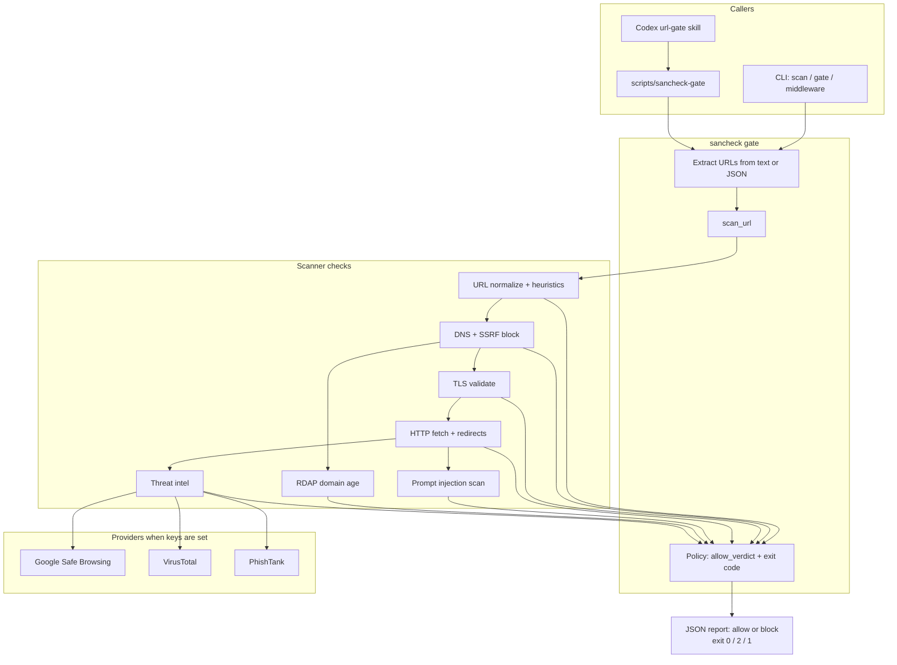

# sancheck

**Repository**: https://github.com/fozagtx/sancheck

**API keys for testing:** [testing keys](https://docs.google.com/document/d/1Ga4IVy5-57BDiO3-JpJu5cgq1fnJpm1Vb943fnYOWB0/edit?usp=sharing)

`sancheck` is a real URL security scanner, link gate, and Codex plugin package. It checks links before an agent workflow, build script, or developer tool opens them, with specific handling for prompt-injection text hidden in fetched pages.

No mock verdicts are used. Network checks are live. Google Safe Browsing, VirusTotal, and PhishTank run only when real API credentials are present; otherwise their checks are reported as `skipped`.

## Architecture



## Documentation

- [How Codex & GPT-5.6 Were Used](CODEX_USAGE.md)
- [Installation & Setup Guide](INSTALL.md)

## Built with Codex

**Codex Session ID**: `019f8658-5272-7480-ae44-3a4ebd620ba2`

Built using Codex with GPT-5.6:
- URL validation and normalization logic
- DNS resolution and SSRF protection
- TLS certificate validation
- HTTP behavior analysis
- Prompt injection detection patterns
- Threat intel provider integrations
- CLI interface and middleware contract

## What It Checks

- URL structure: userinfo tricks, IP literals, uncommon ports, suspicious keywords, long or encoded paths.
- DNS and SSRF safety: loopback, private, link-local, multicast, reserved, and unspecified IPs are blocked by default.
- HTTPS/TLS: certificate chain and expiration are checked for HTTPS URLs.
- HTTP behavior: redirects, status codes, content type, headers, and final targets are inspected.
- Prompt injection: bounded page text and HTML samples are scanned without executing page scripts.
- Reputation: shorteners, risky-looking hosts, new domains via RDAP, and live providers when keys are set.

## Quick Start

Scan one URL:

```sh
PYTHONPATH=src python3 -m sancheck scan https://example.com --format text
```

Use the middleware contract:

```sh
printf 'check https://example.com' | ./scripts/sancheck-gate
```

Gate links from a prompt or Markdown file:

```sh
PYTHONPATH=src python3 -m sancheck gate --stdin --format json < message.md
```

Exit codes:

- `0`: all scanned links are allowed.
- `2`: at least one link is blocked by policy.
- `1`: scanner usage or runtime failure.

## Codex Plugin Package

The repo includes a bundled plugin at:

```text
plugins/sancheck
```

The plugin contains:

- `.codex-plugin/plugin.json` - Plugin manifest
- `skills/url-gate/SKILL.md` - URL gate skill for Codex
- `scripts/sancheck-gate` - Gate script entry point
- Bundled scanner source under `scripts/src/sancheck`

### Using the Plugin

The bundled gate works without installing the Python package:

```sh
# Scan from stdin (text or JSON)
printf '{"text":"open https://example.com"}' | plugins/sancheck/scripts/sancheck-gate

# Scan a URL directly
plugins/sancheck/scripts/sancheck-gate https://example.com

# Gate URLs from a file
cat urls.txt | plugins/sancheck/scripts/sancheck-gate
```

The plugin emits JSON and exits with:
- `0`: all scanned links are allowed
- `2`: at least one link is blocked by policy
- `1`: scanner usage or runtime failure

### How Codex uses the plugin

The plugin is a skill plus the same `sancheck-gate` script (local gate, same as CLI).

API keys stay on your PC. You do not paste them into the Codex app. Put them in a local `.env` (or export them in the shell), then start Codex.

1. Install the plugin (see INSTALL.md).
2. Add keys in one of these places:
   - `.env` in the project you open with Codex, or
   - `.env` next to the installed plugin (for example `~/.codex/plugins/sancheck/.env`)
3. On a task with URLs, the `url-gate` skill tells Codex to run `sancheck-gate` first.
4. Exit `0` and `"allowed": true` → Codex continues. Exit `2` → Codex stops and reports the blocked URL.

`sancheck-gate` loads `.env` automatically and also reads exported environment variables.

Example task:
```
Fetch the content from https://example.com and summarize it
```

## Provider Keys

Keys: [testing keys](https://docs.google.com/document/d/1Ga4IVy5-57BDiO3-JpJu5cgq1fnJpm1Vb943fnYOWB0/edit?usp=sharing)

Copy `.env.example` to `.env` and fill in keys. `sancheck` loads `.env` from the repo root automatically (`.env` is gitignored).

```sh
cp .env.example .env
# edit .env, then:
PYTHONPATH=src python3 -m sancheck scan https://github.com --format=json
```

Or export in the shell:

```sh
export GOOGLE_SAFE_BROWSING_API_KEY="..."
export VIRUSTOTAL_API_KEY="..."
export PHISHTANK_APP_KEY="..."
```

Unset keys show as `skipped`. Keys are for your machine / `.env`, not a Codex cloud settings panel.

CLI check that providers are live:
```sh
PYTHONPATH=src python3 -m sancheck scan https://example.com --format json
# Safe Browsing test URL: expect google_safe_browsing: match, exit 2
PYTHONPATH=src python3 -m sancheck scan 'https://testsafebrowsing.appspot.com/s/malware.html' --format json
```

## Landing Page

The web project is a static landing page for the tool, not the scanner runtime:

```sh
npm install
npm run dev
```

Build and preview:

```sh
npm run build
npm run preview
```

## Tests

```sh
npm run check
```

The tests use a real local HTTP server and deterministic local content. They do not mock scanner verdicts or external provider responses.
